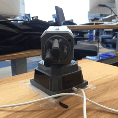

# Slack Missile Launcher

Fire missiles at your enemies using the [Dream Cheeky missile launcher](http://dreamcheeky.com/thunder-missile-launcher) and Slack! For example `/shoot ben`.



Based on code by https://github.com/codedance/Retaliation

## Setup

### Run the webserver on a machine with the launcher device attached.

You need to run a webserver that you can make Slack command hook too.

```
cp targets_sample.json targets.json
virtualenv venv
pip install -r requirements.txt
source venv/bin/activate
python missile.py
```

### Expose the webserver to the public.

One quick and dirty way to do this is with [ngrok](https://ngrok.com/)

### Add the Slack command hook

Add a [Slack command hook](https://api.slack.com/slash-commands) and point it to your webserver: http://yourserver.com/slack

### Test the connection!

Does `/shoot right 1000` move the device for 1 second?

### Update targets.json to your liking.

The format is [X, Y], declaring how much the device moves right and then up before shooting.

## Notes

This is super hacky right now, but it works.
